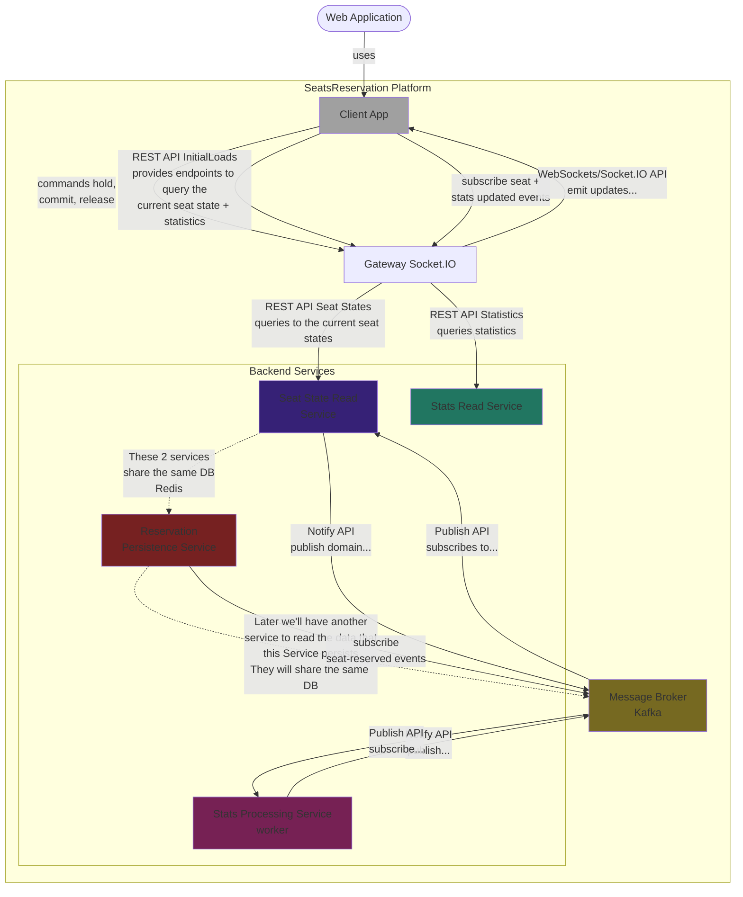

# GitHub Copilot Instructions - Seats Reservation Platform

## 🎯 Project Overview

This is a **Seats Reservation Platform** - a learning-focused microservices architecture demonstrating:
- Event-driven architecture with CQRS patterns
- Real-time updates via WebSockets (Socket.IO)
- Distributed systems with message brokers (Kafka)
- Multiple data stores (Redis for state, Postgres for persistence)
- Monorepo structure with independent services

**Purpose:** Educational playground for exploring modern distributed system concepts, DevOps, and scalability patterns.

---

## 🏗️ System Architecture



### Service Responsibilities

**Client App** (`client-app/`)
- React + Vite frontend
- Socket.IO client for real-time updates
- Visualization of seat maps and statistics

**Gateway Service** (`gateway-service/`)
- Socket.IO server + REST endpoints
- Zero business logic - pure orchestration layer
- Broadcasts events to connected clients
- Initial load from Seat State Read & Stats Read services

**Seat State Read Service** (To be implemented)
- Query-side for seat map (CQRS pattern)
- Reads from Redis for current seat state
- Provides initial state to clients via Gateway

**Reservation Service** (To be implemented)
- Write-side / Command handler (CQRS pattern)
- Source of truth for seat changes (atomic operations in Redis)
- Emits events: `seat.held`, `seat.reserved`, `seat.released`

**Reservation Persistence Service** (To be implemented)
- Subscribes to `seat.reserved` events
- Writes to Postgres for historical record
- Used by downstream systems (payments, reporting)

**Stats Worker Service** (To be implemented)
- Subscribes to all seat-related events
- Computes aggregates (section-level, event-level stats)
- Publishes `stats.updated` events

**Stats Read Service** (To be implemented)
- Query-side for statistics
- Reads from Postgres projections (or Redis cache)

---

## 🛠️ Tech Stack

- **Frontend:** React, TypeScript, Vite
- **Backend:** Node.js, TypeScript, Express
- **Real-time:** Socket.IO
- **Message Broker:** Kafka
- **Databases:** Redis (state), Postgres (persistence/projections)
- **Containerization:** Docker
- **Testing:** Jest, Vitest

---

## 📐 Coding Standards

### General Principles

1. **Service Independence:** Each service should be independently deployable
2. **Event-Driven:** Services communicate via events, not direct calls
3. **CQRS Pattern:** Separate read and write models where appropriate
4. **Idempotency:** Event handlers must be idempotent
5. **Error Handling:** Comprehensive error handling with proper logging
6. **Type Safety:** Leverage TypeScript strictly - no `any` types

### TypeScript Standards

```typescript
// ✅ Good: Use interfaces for data contracts
interface SeatReservedEvent {
  eventId: string;
  seatId: string;
  userId: string;
  timestamp: number;
}

// ✅ Good: Use enums for constants
enum SeatStatus {
  AVAILABLE = 'available',
  HELD = 'held',
  RESERVED = 'reserved'
}

// ✅ Good: Explicit return types
function processSeatReservation(seat: Seat): Promise<ReservationResult> {
  // implementation
}

// ❌ Bad: Using any
function processEvent(event: any) { }

// ❌ Bad: No error handling
async function saveToDatabase(data: any) {
  await db.save(data); // No try-catch
}
```

### File Organization

```
service-name/
├── src/
│   ├── config/          # Configuration and environment variables
│   ├── domain/          # Domain models and business logic
│   ├── events/          # Event handlers and publishers
│   │   ├── handlers/
│   │   ├── publishers/
│   │   └── dtos/
│   ├── services/        # Business services
│   ├── repositories/    # Data access layer
│   ├── api/             # REST/WebSocket endpoints
│   └── utils/           # Shared utilities
├── tests/
├── package.json
├── tsconfig.json
└── README.md
```

### Event Naming Convention

Use domain-driven event names in past tense:
- `seat.held` - Seat temporarily held by user
- `seat.reserved` - Seat permanently reserved
- `seat.released` - Seat hold/reservation released
- `stats.updated` - Statistics recomputed

### Event Schema Pattern

```typescript
interface DomainEvent {
  eventType: string;      // Event identifier
  aggregateId: string;    // ID of the entity (e.g., seatId)
  eventId: string;        // Unique event ID (for idempotency)
  timestamp: number;      // Unix timestamp
  version: number;        // Schema version
  payload: unknown;       // Event-specific data
  metadata?: {            // Optional metadata
    correlationId?: string;
    causationId?: string;
    userId?: string;
  };
}
```

---

## 🔧 Common Development Tasks

### Adding a New Service

1. Create service directory with standard structure
2. Add `package.json` with necessary dependencies
3. Implement service interface in `src/services/`
4. Add event handlers in `src/events/handlers/`
5. Configure Docker setup
6. Add service-specific README
7. Update main README architecture section

### Adding a New Event

1. Define event DTO in `src/events/dtos/`
2. Create event publisher in `src/events/publishers/`
3. Implement event handler in consuming service
4. Add event to message broker topic configuration
5. Update documentation

### Adding a New REST Endpoint

1. Define request/response DTOs
2. Implement service method with business logic
3. Add route handler with validation
4. Add error handling middleware
5. Document endpoint in service README

### Testing Guidelines

- **Unit Tests:** Test business logic in isolation
- **Integration Tests:** Test service interactions via events
- **E2E Tests:** Test complete user flows through Gateway
- **Performance Tests:** Load test real-time event handling

```typescript
// Example test structure
describe('SeatReservationService', () => {
  describe('holdSeat', () => {
    it('should hold an available seat successfully', async () => {
      // Arrange
      const seat = createMockSeat({ status: SeatStatus.AVAILABLE });
      
      // Act
      const result = await service.holdSeat(seat.id, userId);
      
      // Assert
      expect(result.status).toBe(SeatStatus.HELD);
      expect(mockEventPublisher).toHaveBeenCalledWith(
        expect.objectContaining({ eventType: 'seat.held' })
      );
    });
  });
});
```

---

## 🎨 Frontend Guidelines

### React Component Standards

- Use functional components with hooks
- Implement proper TypeScript types for props
- Use custom hooks for Socket.IO connections
- Implement optimistic UI updates with rollback on error

```typescript
// ✅ Good: Typed component with custom hook
interface SeatMapProps {
  eventId: string;
  onSeatSelected: (seatId: string) => void;
}

function SeatMap({ eventId, onSeatSelected }: SeatMapProps) {
  const { seats, loading, error } = useSeatState(eventId);
  const { emit } = useGatewaySocket();
  
  const handleSeatClick = (seatId: string) => {
    emit('seat:hold', { seatId });
    onSeatSelected(seatId);
  };
  
  // ...
}
```

### State Management

- Local state for UI-only concerns
- Socket.IO for real-time data sync
- Consider adding Zustand/Jotai for complex client state

---

## 🐳 Docker & DevOps

### Docker Compose Structure

Services should be composable and independently startable:

```yaml
services:
  gateway:
    depends_on:
      - kafka
      - redis
  
  seat-state-read:
    depends_on:
      - redis
  
  stats-worker:
    depends_on:
      - kafka
      - postgres
```

### Environment Variables

Use `.env` files with clear documentation:

```bash
# Service Configuration
NODE_ENV=development
PORT=3000

# Redis Configuration
REDIS_HOST=localhost
REDIS_PORT=6379

# Kafka Configuration
KAFKA_BROKERS=localhost:9092
KAFKA_CLIENT_ID=gateway-service

# Message Topics
TOPIC_SEAT_EVENTS=seat-events
TOPIC_STATS_EVENTS=stats-events
```

---

## 🔍 Debugging & Troubleshooting

### Common Issues

1. **Event Not Received:** Check Kafka topics, consumer groups, message format
2. **Socket.IO Not Updating:** Verify room subscriptions, event names
3. **Redis Connection:** Ensure Redis is running, check connection config
4. **Race Conditions:** Implement proper locking for seat reservations

### Logging Standards

Use structured logging with correlation IDs:

```typescript
logger.info('Processing seat reservation', {
  correlationId: event.metadata.correlationId,
  seatId: event.payload.seatId,
  userId: event.metadata.userId,
  timestamp: event.timestamp
});
```

---

## 📚 Resources & References

- **CQRS Pattern:** Read/Write separation for scalability
- **Event Sourcing:** Events as source of truth (future consideration)
- **Socket.IO Rooms:** For efficient client targeting by eventId
- **Kafka Consumer Groups:** For parallel event processing
- **Redis Transactions:** For atomic seat state changes

---

## 🚀 When Adding New Features

1. **Think Event-First:** What events will be emitted/consumed?
2. **Consider Scale:** Will this work with 1000 concurrent users?
3. **Idempotency:** Can this handler safely process the same event twice?
4. **Failure Modes:** What happens if Redis/Kafka/Postgres is down?
5. **Observability:** Add logging, metrics, tracing
6. **Documentation:** Update service README and architecture diagrams

---

## 💡 Helpful Commands

When asked to perform common tasks, use these patterns:

**Run a specific service:**
```bash
cd <service-name> && npm run dev
```

**Run tests for a service:**
```bash
cd <service-name> && npm test
```

**Start all services with Docker:**
```bash
docker-compose up -d
```

**Check Kafka topics:**
```bash
docker exec -it kafka kafka-topics --list --bootstrap-server localhost:9092
```

**Monitor Redis:**
```bash
redis-cli MONITOR
```

---

Remember: This is a learning project - prioritize clarity, documentation, and demonstrating architectural patterns over premature optimization.
