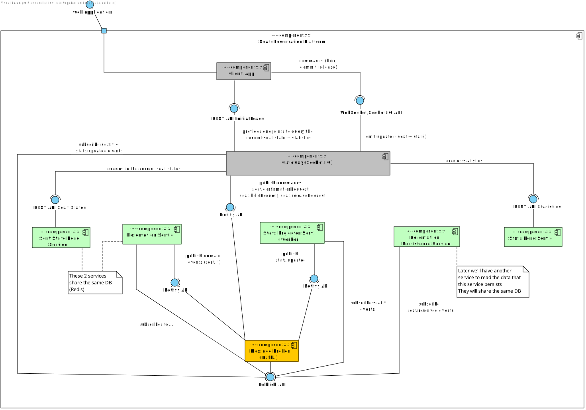

# Seats Reservation Platform (in-progress)

Welcome to the Seats Reservation project! This repository is a playground for exploring modern software architecture concepts, with a focus on:

- **Microservices** (using a monorepo for simplicity)
- **System design** and distributed systems
- **DevOps** (infrastructure, CI/CD, observability)
- **Scalability, performance, and concurrency**

---

## 🚀 Project Goals

- Demonstrate best practices in microservices and event-driven architecture
- Explore real-world system design patterns
- Practice DevOps workflows (Docker, CI/CD, monitoring, etc.)
- Provide a reference for building scalable, maintainable distributed systems

---

## 🏗️ Architecture Overview

The platform is composed of several independent services, each responsible for a specific domain. All services communicate via events and APIs. Each service has its own README for implementation details.

Click to expand: Service Overview

### Reservation Service (Write-side, Command Handler)
- Source of truth for seat changes (atomic ops in Redis)
- Emits events (`seat.held`, `seat.reserved`, `seat.released`)
- Shares its database (Redis) with Seat State Read Service

### Reservation Persistence Service (Final Persistence)
- Subscribes to `seat.reserved` events
- Writes completed reservations into a dedicated Postgres table
- Purpose: historical record / downstream consumption (payments, reporting, exports, etc)
- Has its own Postgres database

### Seat State Read Service (Query-side for Seat Map)
- Provides initial seat map when a client connects
- Reads directly from Redis for the freshest state
- Example endpoint: `GET /events/{eventId}/seats`
- Used by the Gateway for initial client load

### Stats Projector Service (Worker)
- Subscribes to all seat-related events
- Updates aggregates in Postgres (section-level, event-level stats)
- Optionally caches hot stats in Redis
- Publishes `stats.updated` events after recomputing

### Stats Read Service
- Simple REST service that queries Postgres projections (or Redis cache)
- Example endpoints:
  - `/stats/event/{eventId}`
  - `/stats/event/{eventId}/section/{sectionId}`

### Gateway (Socket.IO + REST)
- Contains zero business logic
- For initial load: calls Seat State Read and Stats services
- For real-time: subscribes to `seat.*` and `stats.updated` events and broadcasts to clients

---

## 🛠️ Tech Stack

- **Frontend:** React + Vite
- **APIs & Real-time:** Socket.io, REST, TypeScript
- **Datastores:** Redis, Postgres
- **Messaging:** Kafka
- **Containerization:** Docker
- **Other:** (to be added)

> _Each technology is chosen to illustrate a specific architectural or operational concept. See individual service READMEs for details._

---

## 🗺️ Logical Architecture

Below is a C4 Level 2 logical view of the platform, showing service interactions (infra details omitted for clarity, will be addressed later):

---

## 📁 Service Structure

Each service lives in its own directory with a dedicated README. See those files for implementation, API, and deployment details.Here's a quick overview of each service

---

## 🤝 Contributing

Contributions, suggestions, and questions are welcome! Please open an issue or pull request.

---

_This project is a work in progress and intended for learning and experimentation._
